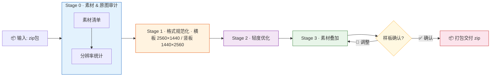

# 明源场宣图简易制作 (Mingyuan Venue Image Creator)

> 批量场宣图片规范化处理工具链 —— 格式标准化 → 轻度优化 → 素材叠加 → 打包交付

[](https://github.com/Alix2395/mingyuan-venue-image-creator/releases)
[](https://www.python.org/)
[](LICENSE)

---

## 📋 工作流总览



---

## 🧩 四阶段管线（附过程预览）

### Stage 0 — 素材审计 & 原图审计

> **目的**：清点输入素材、验证透明度支持、统计原图分辨率分布

**素材审计**：列出所有 PNG 素材（Logo / 水印 / 二维码 / 徽章），确认文件完整性、透明度（RGBA）和尺寸。若素材缺失或为 RGB 模式则标记告警。


**原图审计**：统计全部原图的分辨率分布——横板/竖板比例、极端比例标注。为后续规范化策略提供依据。


| 指标 | 说明 |
|------|------|
| 输入 | 任意分辨率 JPG/PNG |
| 输出 | 素材清单 + 分辨率分布报告 |
| 门禁 | CJK 字体可用性验证 |

---

### Stage 1 — 格式规范化（2K 标准）

> **目的**：将所有图片统一到 2K 标准分辨率，无拉伸变形

| 原图类型 | 处理方式 | 目标分辨率 |
|----------|---------|-----------|
| 横板 (宽＞高) | 等比缩放 → 居中智能裁切 | **2560 × 1440** |
| 竖板 (高＞宽) | 等比缩放 → 居中智能裁切 | **1440 × 2560** |
| 近似比例 (偏差＜3%) | 直接缩放 | 同左 |
| 极端比例 (超宽/超高) | 等比缩放 → 居中裁切 | 同左 |

**核心原则：**
- ✅ 等比缩放保留主体比例
- ✅ 居中智能裁切保留视觉重心
- ❌ **禁止拉伸变形**
- ✅ EXIF 方向自动修正（手机竖拍自动旋转）


*上图展示了四种典型场景的处理策略：4:3→16:9 智能裁切、超宽屏居中裁切、3:4→9:16 智能裁切、超高屏居中裁切*

---

### Stage 2 — 轻度优化

> **目的**：保守增强图片观感，不做破坏性滤镜

**优化参数（保守级）：**

```
亮度    +5%
对比度  +10%
饱和度  +5%
白平衡  自动微调
```

| 禁止操作 |
|---------|
| ❌ 锐化 |
| ❌ 降噪 |
| ❌ 大幅调色 / AI 内容识别 |
| ❌ 超出保守范围的参数 |

对于分辨率已达标或质量退化的图片，自动跳过处理。


*上图展示了四种样本优化前后的亮度均值与对比度变化。参数一致：亮度+5%、对比度+10%，保守且可预期*

---

### Stage 3 — 素材叠加

> **目的**：将透明 PNG 素材精确定位叠加到图片上

**工作流程：**

1. **样板确认**：先处理 1 张横板样板 → 发给用户确认
2. **用户确认后** → 全量处理所有图片

**位置映射表：**

| 描述 | 定位方式 |
|------|---------|
| `top-left` | 距左边 margin px，距上边 margin px |
| `top-right` | 距右边 margin px，距上边 margin px |
| `bottom-left` | 距左边 margin px，距下边 margin px |
| `bottom-right` | 距右边 margin px，距下边 margin px |
| `top-center` | `x=(bg_w-asset_w)/2`，`y=margin` |
| `bottom-center` | `x=(bg_w-asset_w)/2`，`y=bg_h-asset_h-margin` |
| `center` | `x=(bg_w-asset_w)/2`，`y=(bg_h-asset_h)/2` |

**关键约束：**
- ✅ 透明 PNG 完整保留 Alpha 通道
- ✅ 素材重叠自动检测并告警
- ❌ `bottom-center` 必须落在底部居中（禁止偏移到画面中部）


*上图展示了横板和竖板两种方向下的素材定位效果：右上角 Logo、左上角徽章、右下角二维码、底部居中水印*

**全量成品抽检：** 所有图片叠加完成后，自动生成总览图


*上图以 3×4 网格展示横板与竖板样本各 12 张，最终分辨率统一为 2560×1440（横板）和 1440×2560（竖板）*

---

## 🚀 快速开始

### 环境要求

```bash
pip install Pillow
apt-get install -y fonts-wqy-zenhei  # CJK 字体（中文渲染必需）
```

### 准备素材

将原图和素材按以下结构放入 zip：

```
场宣素材.zip
├── 素材/           # PNG素材（Logo、水印、二维码等）
│   ├── logo.png
│   └── ...
└── 原图/           # 待处理原图（任意分辨率/格式）
    ├── photo1.jpg
    └── ...
```

### 运行

```bash
# 一键全链路（自动全量）
python 工具/pipeline.py 场宣素材.zip 示例/config.json --auto-confirm

# 分步执行
python 工具/normalize_resolution.py 测试数据/原图 临时/normalized
python 工具/enhance_images.py 临时/normalized 临时/enhanced
python 工具/overlay_assets.py 临时/enhanced 示例/config.json 临时/final
python 工具/checklist_validator.py 临时/final
```

---

## 🛠️ 工具脚本一览

| 脚本 | 功能 | 版本 |
|------|------|------|
| `工具/pipeline.py` | 一键全链路管线 | ✅ v0.3 |
| `工具/normalize_resolution.py` | 格式规范化到 2K | ✅ EXIF+验证 |
| `工具/enhance_images.py` | 轻度图片优化 | ✅ 跳过+退化解 |
| `工具/overlay_assets.py` | PNG 素材叠加 | ✅ 重叠检测 |
| `工具/generate_test_data.py` | 测试数据生成 | ✅ seed支持 |
| `工具/checklist_validator.py` | 产出质量验证 | ✅ 多维度检查 |
| `工具/create_process_previews.py` | 过程预览拼图生成 | ✅ CJK字体 |

---

## 📝 配置文件

```json
{
  "assets": [
    {
      "file": "素材/logo.png",
      "position": "top-right",
      "scale": 0.15,
      "margin": 40
    }
  ],
  "output_quality": 95,
  "enhance": {
    "brightness": 1.05,
    "contrast": 1.10,
    "color": 1.05
  }
}
```

**位置选项：** `top-left` `top-right` `bottom-left` `bottom-right` `center` `top-center` `bottom-center`

---

## 📦 版本日志

| 版本 | 日期 | 说明 |
|------|------|------|
| **v0.3.1** | 2026-05-22 | 📊 README 重写：工作流可视化 + 各阶段预览图 + 过程效果展示 |
| **v0.3.0** | 2026-05-22 | 🔒 安全加固：107项审计修复、CJK字体门禁、EXIF处理、退化解检测 |
| **v0.2.0** | 2026-05-21 | 🚀 过程预览系统、测试数据集、仓库重构 |
| **v0.0.1** | 2026-05-15 | 初始版本 |

---

## 👤 作者

**Alix** — 明源云海南

---

## 📄 许可证

MIT License
